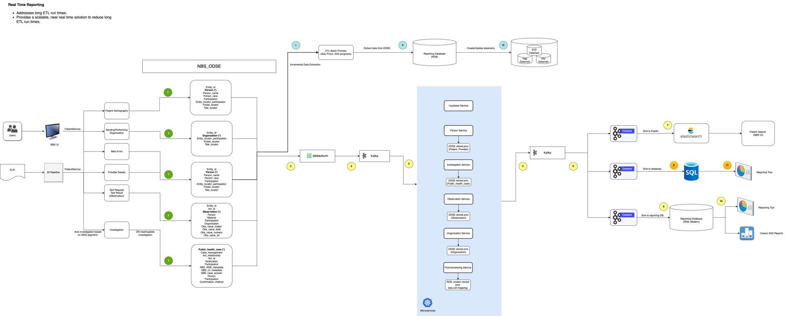

# Local Development Setup



## Docker Containers

1. [mssql](../containers/db/Dockerfile) - Restored MSSQL Server database pre-configured to work with RTR. Notable configurations
   1. NBS_ODSE.NBS_Configuration entry added with `config_key = 'ENV'`, `config_value = 'UAT'`
   1. RTR User creation scripts applied
   1. Change Data Capture (CDC) enabled for relevant databases and tables
1. [liquibase](../liquibase-service/Dockerfile.local) - Liquibase container with all migration scripts copied from [liquibase-service/src/main/resources/db/](../liquibase-service/src/main/resources/db/). Configured to automatically apply migrations and 1 time onboarding scripts and then close. Entrypoint: [migrate.sh](../containers/liquibase/migrate.sh)
1. [zookeeper](../docker-compose.yaml) - Manages the kafka cluster
1. [kafka](../docker-compose.yaml) - Message broker
1. [kafka-connect](../containers/kafka-connect/Dockerfile) - Reads from the `nrt_*` topics and inserts into `rdb_modern` tables. Requires POST of [mssql-connector.json](../containers/kafka-connect/mssql-connector.json) after container start up.
1. [debezium](../docker-compose.yaml) - Reads Change Data Capture logs and posts messages to Kafka. Requires POST for each connector to be sent after container start up.
1. [investigation-service](../investigation-service/Dockerfile) - Processes Kafka message for Investigation data
1. [ldfdata-service](../ldfdata-service/Dockerfile) - Processes Kafka message for Locally Defined Field (LDF) data
1. [observation-service](../observation-service/Dockerfile) - Processes Kafka message for Observation data
1. [organization-service](../organization-service/Dockerfile) - Processes Kafka message for Organization data
1. [person-service](../person-service/Dockerfile) - Processes Kafka message for Person data
1. [post-processing-service](../post-processing-service/Dockerfile) - Handles mapping key-uid mappings

## Initial Setup

The first time containers are built, the liquibase container will need to be started. All following startups can bypass running liquibase.

### Prerequisites:

- [Docker GHCR Authentication](documentation/DockerAuth.md)

### Build the RTR database and liquibase containers

```sh
docker compose up mssql liquibase -d
```

Wait on liquibase container to complete migration and run onboarding scripts. Container will stop when complete.

### Build zookeeper, kafka, kafka-connect, debezium containers

```sh
docker compose up zookeeper kafka kafka-connect debezium -d
```

### Enable connectors for debezium

```sh
curl -i -X POST -H "Accept:application/json" -H "Content-Type:application/json" localhost:8085/connectors/ -d @containers/debezium/odse_connector.json
curl -i -X POST -H "Accept:application/json" -H "Content-Type:application/json" localhost:8085/connectors/ -d @containers/debezium/odse_meta_connector.json
curl -i -X POST -H "Accept:application/json" -H "Content-Type:application/json" localhost:8085/connectors/ -d @containers/debezium/srte_connector.json
```

Active connectors can be verified by sending a GET to `/connectors`

```sh
curl localhost:8085/connectors
```

### Enable connectors for kafka-connect

```sh
curl -i -X POST -H "Accept:application/json" -H "Content-Type:application/json" localhost:8083/connectors/ -d @containers/kafka-connect/mssql-connector.json
```

Active connectors can be verified by sending a GET to `/connectors`

```sh
curl localhost:8083/connectors
```

### Build data processing services

```sh
docker compose up investigation-service ldfdata-service observation-service organization-service person-service post-processing-service -d
```

### Build NBS 6 WildFly container

Run the `build_classic.sh` script to pull the NBS 6 source code and build a WildFly container.

```sh
./containers/build_classic.sh
```

OR manually clone the NBS 6 repository to the proper directory and build docker container

```sh
git clone -b lts/6.0.17 git@github.com:cdcent/NEDSSDev.git containers/wildfly/builder/NEDSSDev
docker compose up wildfly --build -d
```

### Verifying functionality

1. Log into [NBS 6](http://localhost:7003/nbs/login) using the user: `superuser`. No password is required
2. Create a new patient
3. Add an investigation to the patient
4. View `RDB_MODERN.D_PATIENT` and `RDB_MODERN.INVESTIGATION` tables and verify the newly created patient and investigation are present.
