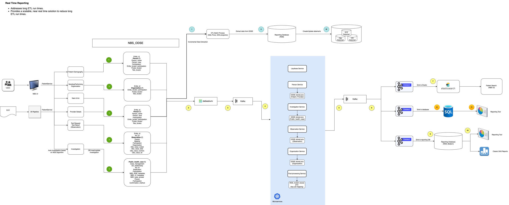

# Local Development Setup



## Docker Containers

1. [mssql](../containers/db/Dockerfile) - Restored MSSQL Server database pre-configured to work with RTR. Notable configurations
   1. NBS_ODSE.NBS_Configuration entry added with `config_key = 'ENV'`, `config_value = 'UAT'`
   1. RTR User creation scripts applied
   1. Change Data Capture (CDC) enabled for relevant databases and tables
1. [liquibase](../liquibase-service/Dockerfile.local) - Liquibase container with all migration scripts copied from [liquibase-service/src/main/resources/db/](../liquibase-service/src/main/resources/db/). Configured to automatically apply migrations and 1 time onboarding scripts and then close. Entrypoint: [migrate.sh](../containers/liquibase/migrate.sh)
1. [zookeeper](../docker-compose.yaml) - Manages the kafka cluster
1. [kafka](../docker-compose.yaml) - Message broker
1. [kafka-connect](../containers/kafka-connect/Dockerfile) - Reads from the `nrt_*` topics and inserts into `rdb_modern` tables. Requires POST of [mssql-connector.json](../containers/kafka-connect/mssql-connector.json) after container start up.
1. [debezium](../docker-compose.yaml) - Reads Change Data Capture logs and posts messages to Kafka. Requires POST for each connector to be sent after container start up.
1. [investigation-service](../investigation-service/Dockerfile) - Processes Kafka message for Investigation data
1. [ldfdata-service](../ldfdata-service/Dockerfile) - Processes Kafka message for Locally Defined Field (LDF) data
1. [observation-service](../observation-service/Dockerfile) - Processes Kafka message for Observation data
1. [organization-service](../organization-service/Dockerfile) - Processes Kafka message for Organization data
1. [person-service](../person-service/Dockerfile) - Processes Kafka message for Person data
1. [post-processing-service](../post-processing-service/Dockerfile) - Handles mapping key-uid mappings
1. [reporting-pipeline-service](../reporting-pipeline-service/Dockerfile) - **FUTURE** service for consolidating all the DataReporting microserices

### Prerequisites:

- [Docker GHCR Authentication](DockerAuth.md)

### Build and run the RTR services

```sh
docker compose up -d
```

### Verifying functionality

1. Log into [NBS 6](http://localhost:7003/nbs/login) using the user: `superuser`. No password is required
2. Create a new patient
3. Add an investigation to the patient
4. View `RDB_MODERN.D_PATIENT` and `RDB_MODERN.INVESTIGATION` tables and verify the newly created patient and investigation are present.
