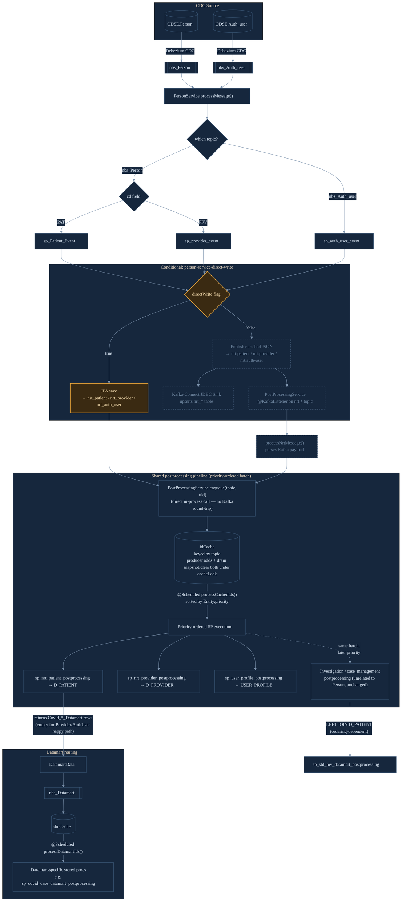

# Person Event Processing — Conditional Data Flow

Describes how `PersonService` routes Patient/Provider/Auth User CDC events, including the
`person-service-direct-write` branch and how both paths converge on the shared postprocessing
pipeline.

🟧 amber = `person-service-direct-write` (active path) · ⬜ dashed = Kafka-Connect (legacy, feature-flagged off)

## Key conditionals

- **`cd` field** routes `nbs_Person` events to patient vs. provider stored procs.
- **`person-service-direct-write` flag** is the main fork: JPA save (direct-write) vs. Kafka
  publish → Kafka-Connect (legacy). Both paths converge on the same
  `PostProcessingService.enqueue()` call into the shared `idCache` — direct-write calls it
  in-process, the legacy path via its existing `@KafkaListener` → `processNrtMessage()`, which
  itself now delegates to `enqueue()` for id-caching.
- **Priority-ordered batch drain** is what keeps `D_PATIENT` hydration ahead of
  investigation/case_management processing within the same cycle. Direct-write must go through
  this same shared pipeline rather than calling postprocessing stored procedures itself —
  bypassing it breaks that ordering guarantee (see APP-787).
- **`cacheLock`** guards every producer-side cache write (`enqueue()` and the legacy path's
  payload-enrichment writes) against the scheduled drain's snapshot-then-clear. Without it, an
  add landing between the drain's snapshot and its `clear()` was silently and permanently
  dropped rather than merely delayed — this affected every entity type processed by this shared
  service, not just Patient/Provider/AuthUser (see APP-787 concurrency follow-up).
- **Datamart routing** only actually carries rows in the happy path for Patient (Covid
  datamarts); Provider/AuthUser postprocessing stored procedures return empty result sets there.

Not shown (orthogonal, non-blocking flags that don't affect this core routing):
`elasticSearchEnable` (publishes to `elastic_search_patient`/`elastic_search_provider` regardless
of direct-write) and `phcDatamartEnable` (async PHC fact datamart update).
